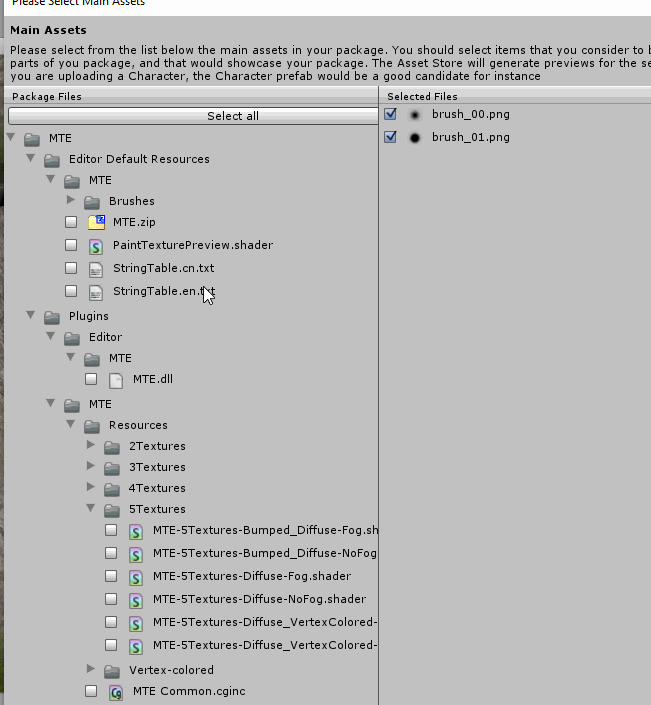

# AssetStoreTools
An improved version of the offical Unity3D asset store tools.

# Usage

1. Build project `AssetStoreTools`.
2. Copy built `AssetStoreTools.dll` to `Assets/AssetStoreTools/Editor/` and overwrite the original one.

You may delete the old `AssetStoreToolsExtra.dll`. It is not used anymore.

# Improvement

* Added a __select all__ button to select all files inside the main assets folder.
  
  